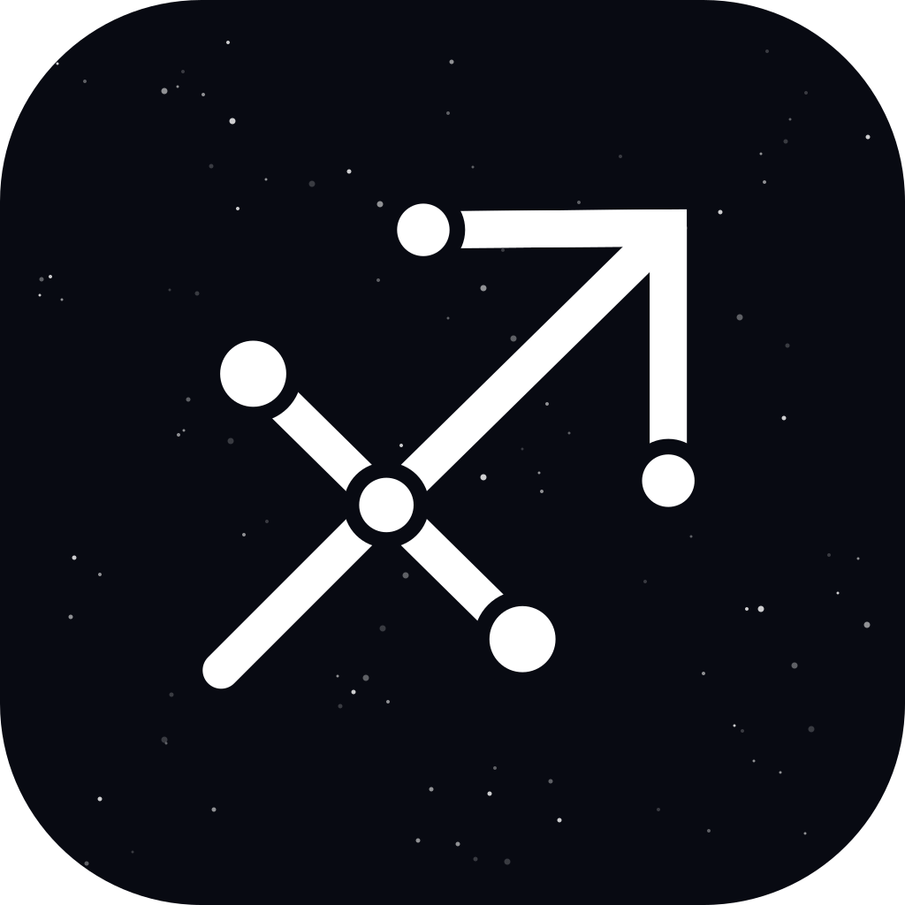

<p align="center"><a href="https://portsidelabs.io/sagittarion"></a></p>

<h1 align="center">Sagittarion</h1>

<p align="center">
<a href="https://github.com/portside-labs/sagittarion/releases/latest"></a>
<a href="https://github.com/portside-labs/sagittarion/releases/latest"></a>
<a href="LICENSE"></a>
</p>

## About Sagittarion

Sagittarion is a free, open-source, AI-native database GUI for SQLite and
PostgreSQL that protects PII. Ask your database questions in plain English;
sensitive values are masked on your machine before they reach the model.

- **Ask in plain English.** Bring your own OpenAI, Anthropic, Gemini,
  OpenRouter or Groq key, or run a model locally with Ollama or LM Studio.
  Generated SQL is read-only and checked with `EXPLAIN` before it runs.
  Instructions teach it your definitions, for every database or just one.
- **Ask across databases.** The chat stays beside your connections, with
  conversations in tabs and a history to pick them up again. Add several
  databases to one and it follows a customer, an order or a request from one
  to the next, to lay out what happened during an incident.
- **Connectors.** Plug MCP servers into Ask, as you would in Claude Desktop,
  so a question can draw on your issue tracker, CRM or files. Sign in to remote
  ones with OAuth in your browser. Choose the connections each one is on for,
  and which tools ask before they run.
- **[Local AI Privacy](docs/LOCAL_AI_PRIVACY.md).** Names, emails, card
  numbers and other sensitive values become placeholders before a request
  leaves your computer, and are restored in the answer. You can inspect
  exactly what was sent.
- **Scales to huge schemas.** The model is sent only the tables a question
  needs, and the sidebar stays quick with a hundred thousand tables.
- **Staged edits.** Review your changes, then apply them together in a single
  transaction.
- **A statement-aware SQL editor.** It runs the statement under the cursor and
  suggests what fits where you're typing.
- **Several connections at once.** Group and colour-code them; every tab comes
  back as you left it.

Works with local and remote databases, over SSH when needed. No account, no
telemetry.

## Download

Get the latest build for macOS, Windows or Linux from
[Releases](https://github.com/portside-labs/sagittarion/releases/latest).

SQLite needs `python3` 3.5 or newer wherever the database file lives. Most
servers already have it; on a Mac, the Xcode Command Line Tools provide it.
PostgreSQL needs version 12 or newer.

## Development

Sagittarion is built with Electron, React and TypeScript, and needs Node.js
22.12 or newer to run from source.

```bash
npm install
npm run dev     # start with hot reload
npm test        # unit and integration tests
npm run dist    # package for this platform into release/
```

[docs/DEVELOPMENT.md](docs/DEVELOPMENT.md) covers how it works, the project
layout and the full test setup.

## Security Vulnerabilities

If you discover a security vulnerability in Sagittarion, please email
[hello@portsidelabs.io](mailto:hello@portsidelabs.io) instead of opening a
public issue.

## License

Sagittarion is open-source software licensed under the
[MIT license](LICENSE).

The SQL editor's optional fonts, JetBrains Mono, Fira Code, IBM Plex Mono and
Source Code Pro, are bundled under the SIL Open Font License 1.1.
